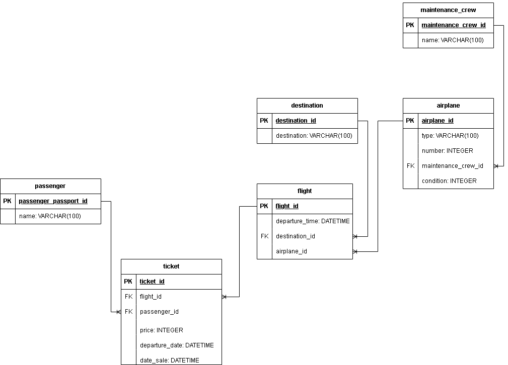

# Концептуальная модель

На основе анализа предметной области "Запись на авиарейс", были выделены следующие информационные объекты, которые необходимо хранить в базе данных:
1. Обслуживающая бригада (maintenance_crew):
    - maintenance_id (integer, PK) - идентификатор обслуживащей бригады
    - name (VARCHAR(100)) - название бригады
2. Самолеты (airplane)
    - airplane_id (integer, PK) - идентификатор самолета
    - type (VARCHAR(100)) - тип самолета
    - number (integer) - номер самолета
    - maintenance_id (integer, FK) - внешний ключ, связанный с таблицей "maintenance_crew"
    - condition (integer) - состояние самолета, от 0 до 100
3. Место прибытия рейса (destination)
    - destination_id (integer, PK) - идентификатор места прибытия рейса
    - destination (VARCHAR(100)) - название места прибытия
4. Вылеты (flight)
    - flight_id (integer, PK) - идентификатор вылетов
    - departure_time (datatime) - время и дата вылета
    - destination_id (integer, FK) - внешний ключ, связанный с таблицей "destination"
    - airplane_id (integer, FK) - внешний ключ, связанный с таблицей "airplane"
5. Пассажиры (passenger)
    - passenger_passport_id (integer, PK) - идентификатор пассажира
    - name (VARCHAR(100)) - имя пассажира
6. Билет (ticket)
    - ticket_id (integer, PK) - идентификатор пассажира
    - flight_id (integer, FK) - внешний ключ, связанный с таблицей "flight"
    - passenger_id (integer, FK) - внешний ключ, связанный с таблицей "passenger"
    - price (integer) - цена билета
    - departure_date (datatime) - время и дата вылета
    - date_sale (datatime) - время и дата продажи

# Логическая модель
На основе концептуальной модели, была построена логическая модель базы данных

# Пользователи
## Пассажир

Функциональные возможности:
- Просмотреть свои билеты
- Удалить свой билет
- Купить билет
- Обновить свои паспортные данные

## Обслуживающая бригада

Функциональные возможности:
- Просмотреть самолеты, за которые отвечает бригада
- Починить самолет

## Администратор

Функциональные возможности:
- Что и у предыдущих ролей
- Удалить самолет
- Добавить самолет
